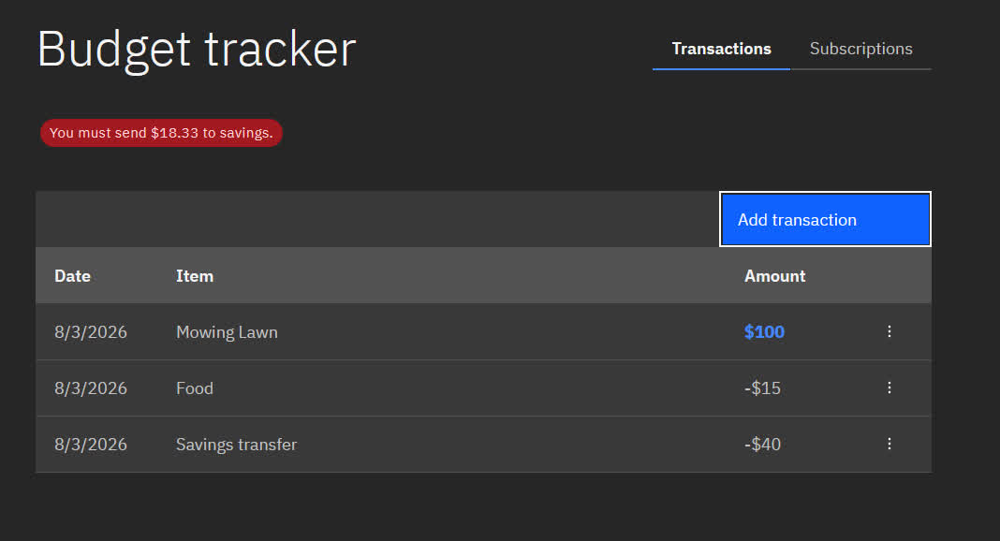
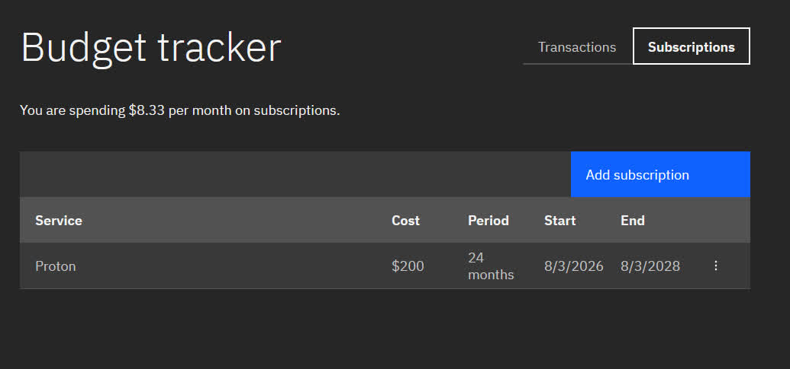

### Custom budgeting website

This is a simple website that I threw together to do some simple math for my budget. The idea is that 50% of all my income goes to savings. It also lets you enter your subscriptions so if for example you pay $200 for a 2 year plan, you can use savings up front, but then pay yourself back.

Features:

- Enter transactions
  - Lets you say if it is to savings to count towards goals
- Add subscriptions
  - Enter start and end date to only make you repay active ones
- All data is saved locally

Go try it at [budget.nicosmith.net](https://budget.nicosmith.net/)

